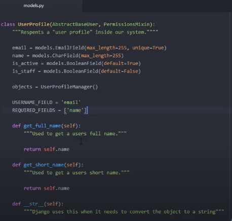

Django
source ~/anaconda3/etc/profile.d/conda.sh

image::./images/FlowOfDjango.PNG[640,640]

Create a Django Project

- `django-admin startproject project_name`
- `settings.py` store project settings
- `urls.py` store all the url patterns for the projects, all the web pages
- `wsgi.py` used to deploy the web app to production
- `manage.py` associated with the commands to build our web apps

To run

- `python manage.py runserver`

To create app

- Django application is to perform a particular functionality for the entire web application
- Reusable / pluggable
- `django-admin startapp name` / `python manage.py startapp name`
- py files
. `admin.py` register models here for Django to use with admin interface
. `apps.py` for application specific configuration
. `models.py` store application's data model
. `views.py` to handle requests and response
. `migration folder` stores sepcific information as it relates to the models

Adding Apps to the project

- Add to `settings.py`
. `rest_framework`
. `rest_framework.authtoken`
. new_app

Requirements file
- `pip freeze` to get the version number packages installed

Models in Django

- Each model maps to a table in the database
- Django handle with the interaction between model and database
- Django model fields: https://www.youtube.com/redirect?q=https%3A%2F%2Fdocs.djangoproject.com%2Fen%2F1.11%2Fref%2Fmodels%2Ffields%2F&redir_token=tJGdmdkNOS-m7Iuapqi51IctoOd8MTU4OTM0MTIxMEAxNTg5MjU0ODEw&event=video_description&v=vYVTps5hJWQ
- Overwrite user permissions
. `from django.contrib.auth.models import AbstractBaseUser`
. `from django.contrib.auth.models import PermissionsMixin`
. add in model's admin.py

Make migrations to database

- `python manage.py makemigrations` create init file for django to know how to create database
- `python manage.py migrate`

APIView

- Uses standard HTTP Methods for functions : GET/PUT/PATCH/DELETE/POST
- For a synchronoous response
- import from `rest_framework.views`
- Require `rest_framework.response` too
- add to urls.py in main folder
. `from django.urls import include`

Serializers

- `from rest_framework import serializers`
- import to `view.api` and use `serializer_class = `

PUT

- pk stands for primary key
- updates entirely

PATCH

- partial updates

