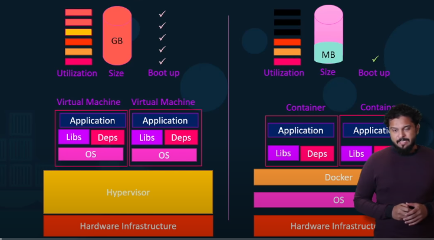
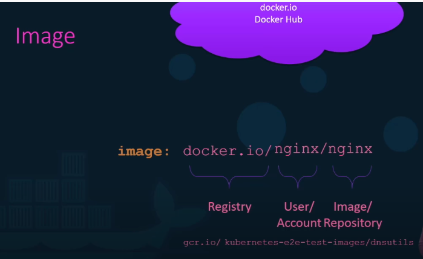

Docker

Why Docker

- Frameworks / libraries require different dependencies like OS/python version etc
- Dependency versions constantly changing
- Hard to set up new environment for new developers
- Rune each component in a separate container with different dependencies
- Docker use LXc containers
- Docker makes use of the underlying OS kernel so the OS kernel must be the same like Linux/Mac/Windows

Docker vs Virtual Machines

Docker Image

- Consists of
. Package
. Template
. Plan
- An instance of Image is a Container
- Common docker images `https://hub.docker.com`

Docker Registry

- By default is deployed to docker hub registry
- Can deploy on cloud hosting platforms like AWS 
- Can be made private on any registry

Docker Command Cheatsheet

image::./images/DockerCheatsheet.PNG[640,640]
- Missing docker exec commmand
- docker run adis:4.0  #tag to know is version 4.0
- docker host web
. docker run -p localhostport:dockerport
- docker persistant data
. docker run -v localdir:dockerdir

dockerised
database
api
seed data
authentication layer to secure the endpoint (security)

frontend
