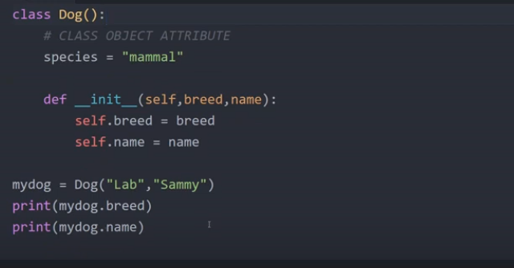
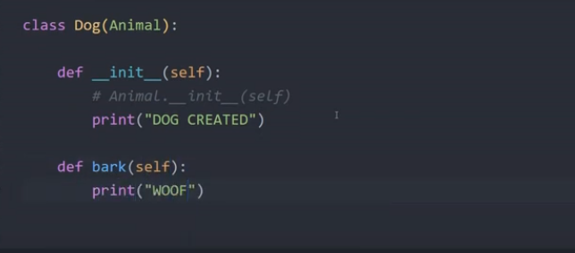
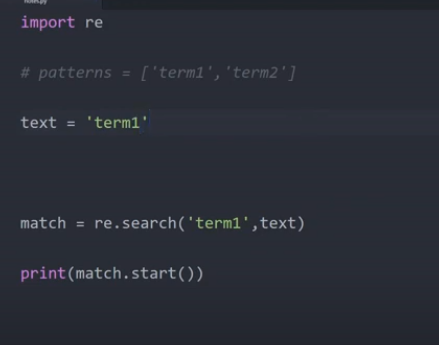
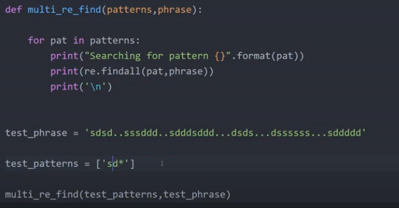

Python

Step size

- mystring[::2] read every 2 character

Print Formating

- `x = "item 1: {}, item 2: {}".format("one", "two")`

Add to List

- .append()
- .extend([1,2,3]) for multiple
- for loop in list `firs_col = [row[0] for row in matrix]` (list comprehension)
- x = [2,3,4]   x = [num**2 for num in x]
- check if something in list 'x' in [1,2,3,'x']

Dictionary

- No order like in javascript
- {"key1": "value1" , "key2":"value2"}

Tuples

- immutable
- (1,2,3)

Set

- set()
- .add(2)
- set([12,,3,4])

Operators

- and \ or

Loops

- for jelly in seq
- for (tup1, tup2) in mypairs
- while

Range

- range(5) / range(0,5)
- range(0,5,2)

function

- naming convention : my_func()
- """ """ docstring

Filter

- filter(function, arr) -> gives a filter object
- list(filter object) to get the list

Python Scope

. in this order
. Local
. Enclosing function locals
. global , `global x`
. built-in

Classes

- `class classname():`
- `__init__(self)`
- `__str__(self)` for toString method
- `__len__(self)` for len(class) method
- `__del__(self)` for del method like `del classinstance1`

Try

- try, except, else, finally

Regular expressions
- ['sd?'] 0 or 1
- ['sd+'] 1 or more
- ['sd*'] 0 or more
- ['sd{1,3}'] 1 or 3 times
- ['a[sd]+'] a is followed by 1 or more s or d
- ['[^!.?]+'] split the string by `!.?`
- ['[A-Z]+'] get all upper case
- [r'\d+'] for all numbers
- [r'\D+'] for all none numbers
- [r'\s+'] for all whitespace

Name and Main

- `if __name__ == '__main__'` -> if run from this and not imported, then run this
- import what as what
- from what import what